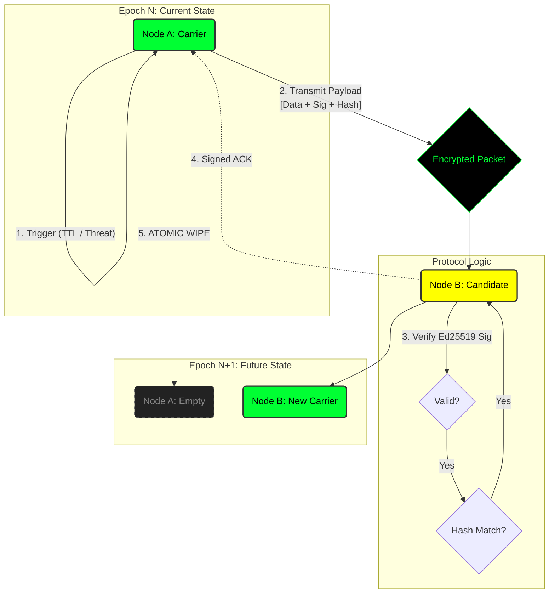

# WDP: Wanderer Data Preservation Protocol (PoC)

> **Status:** Experimental / Proof of Concept  
> **Version:** 0.1.0-alpha  
> **License:** MIT  
> **Spec Reference:** [Engineering Specification v1.1]

## ⚠️ The Problem
In modern distributed systems, static data is vulnerable. If data resides on a specific server (even in decentralized networks like IPFS), that node becomes a target for censorship, seizure, or physical failure. Static storage = Single Point of Failure.

## 🛡️ The Solution: WDP


**Wanderer Data Preservation (WDP)** is a protocol where data is never static. It exists as a "traveling wave" across the network topology. 

Unlike traditional storage, WDP data **must** move to survive.
* **Migration:** Data autonomously moves from node to node based on TTL, latency, or threat detection.
* **Integrity:** Every state transition is cryptographically signed (**Ed25519**) and hashed (**SHA-256**).
* **Resilience:** The protocol mimics biological survival strategies to evade network partitions and node seizures.

## ⚙️ Protocol Workflow
While the "Swarm" handles topology, the individual node migration follows a strict atomic sequence to prevent data loss or duplication.

```mermaid
sequenceDiagram
    autonumber
    participant A as Node A (Current Carrier)
    participant B as Node B (Candidate)
    participant N as Network / Swarm

    Note over A: State v1.0<br/>(Holding Data)

    A->>A: ⚠️ Trigger (Timer/Threat)
    A->>N: DHT Lookup (Find Peers)
    N-->>A: Return: [Node B, Node C...]
    
    A->>B: HANDSHAKE (Prepare Migration)
    B-->>A: READY (Key Exchange)

    Note right of A: Sign(Payload) using Ed25519
    A->>B: TRANSMIT STATE [Payload + Signature]

    Note over B: 1. Calculate SHA-256<br/>2. Verify Signature
    
    alt Integrity Check PASS
        B->>B: Store Data
        B-->>A: ACK_COMMIT (Signed)
        A->>A: 🗑️ SECURE WIPE (Zero-Copy)
        Note over A: Node Empty
        Note over B: State v1.1<br/>(New Carrier)
    else Integrity Check FAIL
        B-->>A: REJECT
        A->>N: Find new Candidate
    end

## 📂 Repository Structure
This repository contains a Python implementation of the core WDP specifications.

| File | Description |
| :--- | :--- |
| `wdp_core.py` | Defines the `State` object, immutable ledger rules, and crypto-primitives (hashing/signing). |
| `wdp_migration.py` | Implements the node-to-node atomic transfer protocol (Migration Logic). |
| `wdp_swarm.py` | A stress-test simulation of a 20-node network under active attack (random node termination). |

## 🚀 Quick Start

### 1. Prerequisites
You need Python 3.8+ and the cryptography library.

```bash
pip install cryptography
```

### 2. Running the Simulation
Watch the protocol survive in a hostile environment (The Swarm). 
This script simulates a network where nodes are randomly "seized" or disconnected while data attempts to migrate.

```bash
python wdp_swarm.py
```

## 🧪 Simulation Results
In local stress tests with N=20 nodes and random failure injection (P_fail=0.3), the protocol demonstrated:
* **100% Data Availability:** The payload successfully migrated through 50+ hops.
* **Zero-Copy Persistence:** No node held the data for longer than the defined epoch.
* **Tamper Resistance:** Any modified payload was immediately rejected by the swarm.

## 🗺️ Roadmap
This is a Proof-of-Concept. The roadmap for v1.0 includes:

- [x] Core Cryptography & State Definition (Python)
- [x] Basic Atomic Migration Logic
- [x] Swarm Survival Simulation
- [ ] Network Transport Layer (TCP/UDP/WebSocket) implementation
- [ ] DHT Integration (Kademlia) for peer discovery
- [ ] **Rust Port** for production performance and memory safety

---
*Authored by VECTOR.*